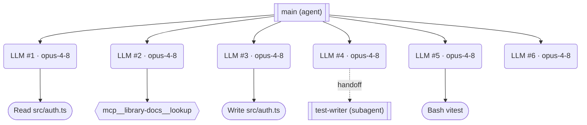
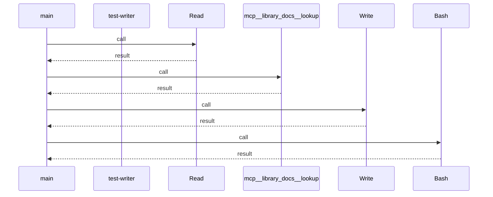
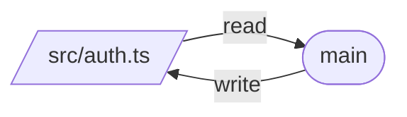
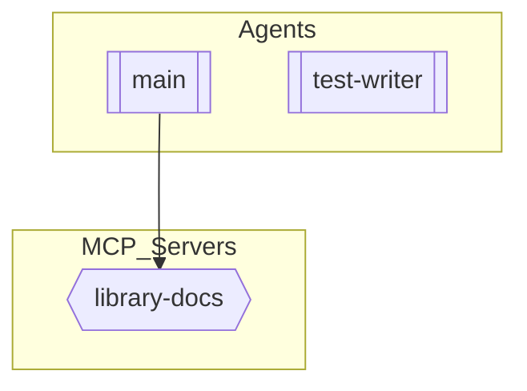

# Example Airflow-style DAG Rendering

Deliverable **#9**. This is the bundled `demo-refactor-auth` run rendered as a DAG. In the
app it appears on the React Flow canvas (top-to-bottom, Airflow-style); here we show the
equivalent auto-generated Mermaid (from `GET /sessions/{id}/diagram`). The Mermaid below
is the real generator output with span ids replaced by readable labels for the doc.

## Flowchart (execution DAG)

The real canvas additionally renders:
- the **`library-docs` MCP server** as a service node, linked from the `mcp__…__lookup`
  tool by an orange `mcp` edge;
- a **`src/auth.ts` file node**, with a cyan `read` edge into the Read tool and a `write`
  edge out of the Write tool (data lineage);
- per-node **latency and cost badges**, and dimming of nodes past the replay cursor.

## Sequence diagram (`type=sequence`, verbatim generator output)

## Dependency graph (`type=dependency`, verbatim)

## System diagram (`type=architecture`, verbatim)

The source trace for this rendering is [`example-trace.json`](example-trace.json).
