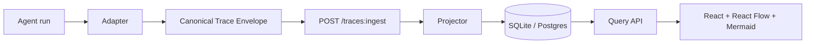

# Agent Canvas

> A visual, Airflow-style canvas for observing Claude Code and AI-agent workflows.

Agent Canvas ingests execution traces from agent frameworks, normalizes them into a single
canonical span model, and renders them as an interactive DAG, a step-by-step timeline, a
cost breakdown, and auto-generated architecture diagrams.

## Why

Agentic runs are hard to observe. A Claude Code session fans out into subagents, tool
calls, MCP servers, file reads and writes, and memory operations — each with its own
latency and token cost. Logs flatten all of that into a scroll. **Agent Canvas turns a run
into a graph you can zoom, replay, and cost out.**

## The idea in one diagram



The keystone is an **OpenTelemetry-GenAI-inspired span model**: every agent, LLM call,
tool call, file I/O, and memory operation is a span with a `span_kind`. Every framework
adapter reduces to "emit spans," which keeps the rest of the system framework-agnostic.

## Quick start

```bash
make backend-install
make seed          # ingest the bundled sample Claude Code trace
make backend       # http://localhost:8000  (OpenAPI at /docs)

make frontend-install
make frontend      # http://localhost:5173
```

Or point it at one of your own Claude Code sessions:

```bash
pip install agentcanvas
agentcanvas ingest ~/.claude/projects/<project>/<session>.jsonl
```

## Where to go next

- [Architecture](architecture.md) — components, data flow, and the design trade-offs
- [Canonical schema](canonical-schema.md) — the contract every adapter emits
- [API](api.md) — endpoint reference
- [Adapters](adapters/claude-code.md) — how each framework maps onto the model
- [Roadmap](roadmap.md) — what's shipped and what's next
